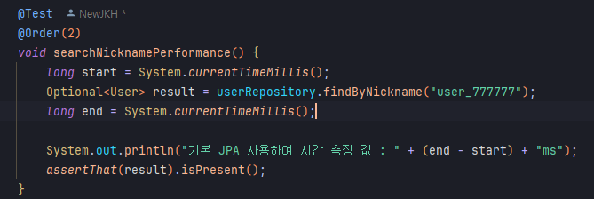
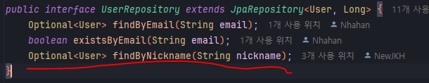

# SPRING PLUS

## 대용량 비교 

---
### 첫번째 시도
( 기본 JPA 를 이용하여 쿼리 실행 )

### 두번째 개선

### 세번째 개선

---
## 결과
처음 시도 : 기본 JPA 742 ms
개선 1: 닉네임으로 아이디 조회 후 아이디로 유저를 조회 : 378 ms
개선 2: DB 인덱스를 사용하여 닉네임으로 유저 조회 : 136 ms